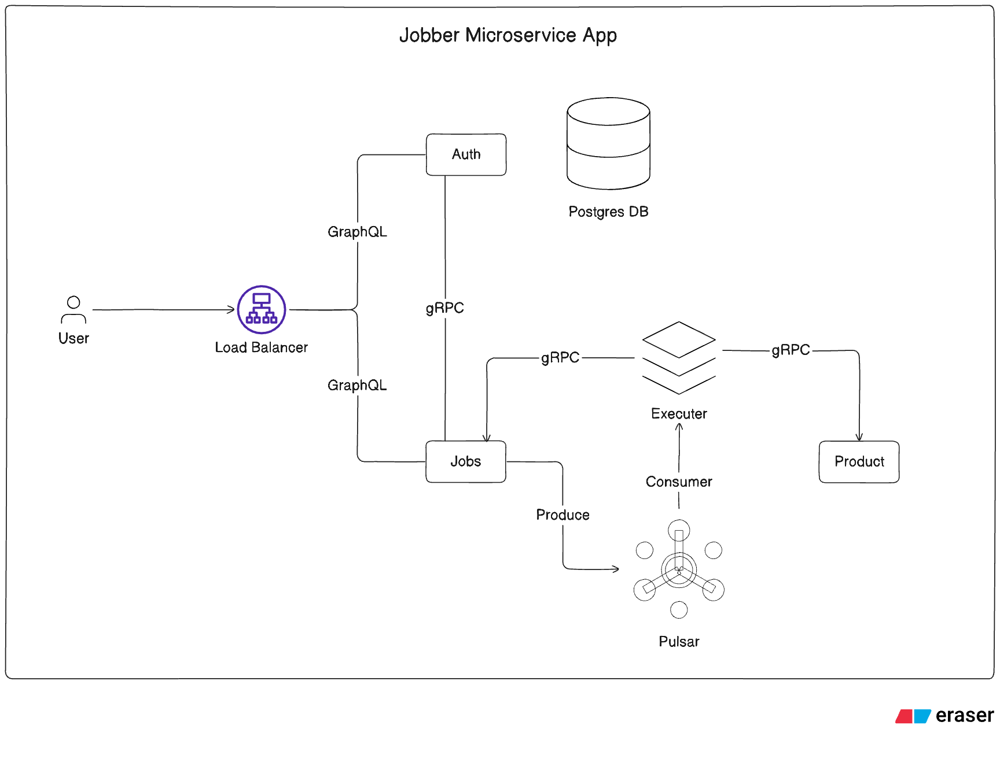

# Jobber Microservice App 🚀

> **Distributed Job Engine with gRPC, Pulsar, Kubernetes & AWS**

---

## 📌 Description

The **Jobber Microservice App** is a fully functional **distributed job engine** designed to handle large-scale job processing with **NestJS microservices**, **Apache Pulsar**, **gRPC**, and **GraphQL**.  
Built with **Nx monorepo architecture**, it ensures scalability, maintainability, and high performance, making it ideal for modern enterprise-grade applications.

This project is designed to provide **hands-on experience** in designing, developing, and deploying **real-world distributed microservices**.

---

## 🔹 Key Features

- ⚡ **Distributed Job Engine** — Build a robust and scalable job processing system
- 🏗️ **Monorepo Architecture** — Use **Nx** for better structure and efficient dependency management
- 🔗 **gRPC Transport Layer** — Enable **high-performance, low-latency** service-to-service communication
- 📩 **Apache Pulsar Messaging** — Reliable **event-driven job processing** with message acknowledgments
- 🧩 **GraphQL API** — Flexible data access with optimized querying and mutation handling
- 🔐 **JWT Authentication** — Secure communication using JWT and **HTTP-only cookies**
- 🧠 **OOP Principles** — Modular, reusable, and maintainable code structure
- 📈 **Horizontal Scaling** — Effortlessly scale services to handle **massive workloads**
- 🐳 **Optimized Dockerization** — Use **Nx libraries** and independent `package.json` files for faster builds
- 🗄️ **Database Layer** — Use **Prisma ORM** + **Drizzle ORM** with **PostgreSQL** for reliable DB management
- ☸️ **Kubernetes Deployment** — Follow best practices for **production-ready container orchestration**
- 🌐 **AWS Production Setup** — Deploy with **custom domains** and **SSL encryption**
- 🏆 **Real-World Experience** — Covers **designing**, **developing**, and **deploying** NestJS microservices end-to-end

---

## 🏛️ Tech Stack

| **Category**         | **Technology**                |
| -------------------- | ----------------------------- |
| **Framework**        | [NestJS](https://nestjs.com/) |
| **Monorepo**         | [Nx](https://nx.dev/)         |
| **Transport Layer**  | gRPC                          |
| **Messaging**        | Apache Pulsar                 |
| **API**              | GraphQL                       |
| **Database**         | PostgreSQL                    |
| **ORM**              | Prisma + Drizzle              |
| **Authentication**   | JWT + HTTP-only cookies       |
| **Containerization** | Docker                        |
| **Orchestration**    | Kubernetes                    |
| **Deployment**       | AWS with SSL & custom domains |

---

## 📦 Project Highlights

- **Monorepo with Nx** → Simplifies multi-service development and dependency management
- **gRPC Communication** → High-speed, efficient inter-service RPC calls
- **Event-Driven Architecture** → Pulsar ensures reliable distributed job scheduling
- **GraphQL API Gateway** → Centralized API layer for all microservices
- **Docker + Kubernetes** → Optimized for **cloud-native deployment**
- **AWS Deployment** → Scalable, secure, and production-ready

---

## 📌 Architecture Overview

The system follows a **microservices architecture** where each service handles a dedicated responsibility:

- **Job Service** → Handles job creation, assignment, and scheduling
- **Worker Service** → Processes jobs and communicates results
- **Auth Service** → Handles authentication & authorization
- **Gateway Service** → Exposes a GraphQL API to clients
- **Message Broker** → Uses **Apache Pulsar** for inter-service messaging
- **Database Layer** → PostgreSQL + Prisma + Drizzle ORM for strong schema management

---

## 🚀 Deployment Strategy

- **Dockerized microservices** for independent builds
- **Kubernetes Helm charts** for container orchestration
- **Horizontal Pod Autoscaling** to handle traffic spikes
- **AWS Deployment** with:
  - Custom domains
  - SSL certificates
  - CI/CD pipelines for smooth updates

---
